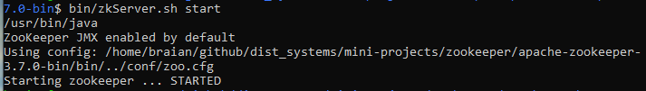
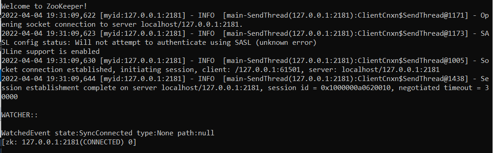
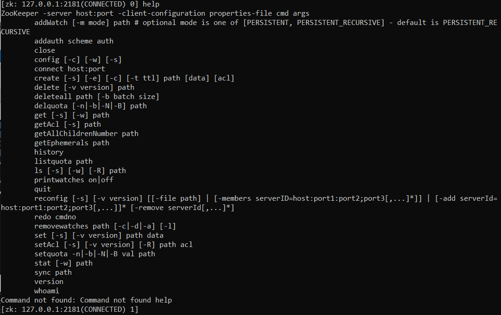
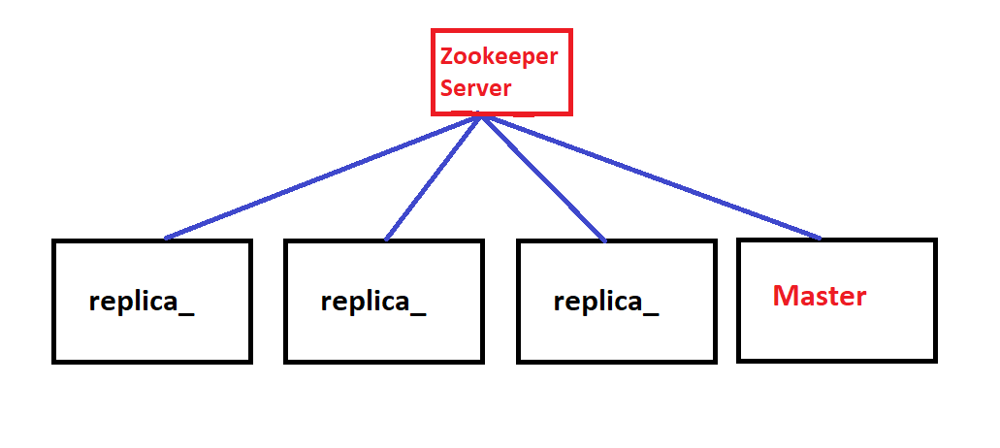
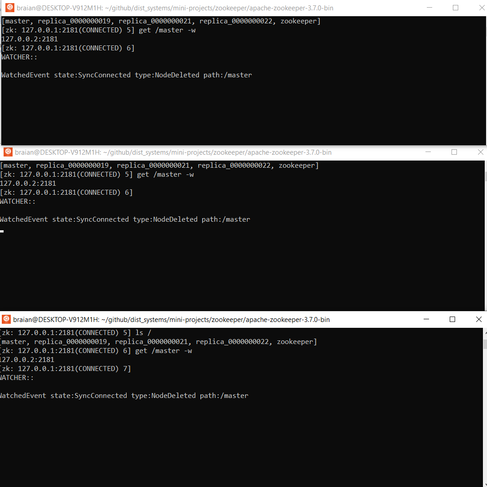

# Apache Zookeeper Tutorial

This tutorial shows how to configure Apache Zookeeper on Ubuntu 20.04, with the following setup:
* A single Zookeeper server;
* N zookeeper client nodes (called __zNodes__). 

The main goal is to demonstrate how to set up all the tools needed to use Apache Zookeeper in a distributed fashion, but for the sake of simplicity all instances of server and clients run on the same computer. Each zookeeper client instance connected to the server will simulate a physical node of a distributed application.
In the real world it is recommended to have at least 3 Zookeeper servers running in separate machines to avoid the server to become a single point of failure. The number of servers must be an odd number to ensure there's a majority quorum in case one server node fails.

For demonstration purposes, it will be shown how Apache Zookeeper behaves in the event of a node failure.

## Requirements
1. Java installed - release 1.8 or greater (JDK 8 LTS, JDK 11 LTS, JDK 12 - Java 9 and 10 are not supported).

To check if you already have Java installed run the following code in a terminal:

```java -version```

If you don't have Java installed, you can install it using `apt` tool. By default, Ubuntu 20.04 includes Open JDK 11, which is an open-source variant of the JRE and JDK.

First update the package index:

```sudo apt update```

Then execute the following command to install the default Java Runtime Environment (it will install the JRE from OpenJDK 11):

```sudo apt install default-jre```

## 1. Configure server and client nodes

In the following sections the Zookeper standalone server will be configured and 4 client instances will connect to it.

## 1.1 Download Apache Zookeeper binaries

Download one of the Zookeeper releases from [here](http://zookeeper.apache.org/releases.html). In this tutorial we'll use the stable release 3.7.0.
Unpack the file in a directory of your choice. Keep in mind this directory will be the used to start the server and client binaries.

## 1.2 Setting up Zookeeper server

First, create a new empty directory for storing Zookeeper server's data:

```mkdir /tmp/zookeeper```

Then, navigate to the directory where the Zookeeper binaries were unpacked, enter the `conf` folder. This folder contains some examples of configuration files for the server (e.g.: `zoo_sample.cfg` has a basic configuration file describing each parameter).
For this tutorial we'll create a new file named `zoo.cfg` inside the `conf` folder.

The file will look like this:
```
tickTime=2000
dataDir=/tmp/zookeeper
clientPort=2181
```

This is the minimal file required for the server to start. Below is the definition of each one of the paramenters, taken from [Apache Zookeeper's website](https://zookeeper.apache.org/doc/current/zookeeperStarted.html)

* __tickTime__ : the basic time unit in milliseconds used by ZooKeeper. It is used to do heartbeats and the minimum session timeout will be twice the tickTime.
* __dataDir__ : the location to store the in-memory database snapshots and, unless specified otherwise, the transaction log of updates to the database.
* __clientPort__ : the port to listen for client connections.

To start the Zookeeper server, run the followin command (assuming you're on the Zookeeper installation folder):

```/bin/zkServer.sh start```

This will initiate the the server on the current machine, making it acessible from clients on the port specified in `conf/zoo.cfg`.



## 1.3 Connecting clients to Zookeeper server

To connect a client to the server using the CLI run the following command:

```bin/zkCli.sh -server 127.0.0.1:2181```



For demonstration purposes we'll connect 4 clients to the server, simulating 4 different nodes of a distributed application. In a real world scenario each one of these clients will be running on a different machine.

To list the commands supported by the CLI type `help`.


Here's the description of the main commands we'll be using:
* __ls__: List all zNodes.
* __create__: Create a znode.
* __get__: Get the data of the specific path. `-w` add a watcher that listens to changes on this node.
* __quit__: Quit de CLI.

In the demo we'll use ephemeral nodes (`-e` option) that don't persist data to the server. In other words, once the client disconnects from the zookeeper server all its data is removed. We'll also use `-s` option for creating sequential nodes, where zookeeper automatically add a suffix to the name specified adding a unique sequential integer.

## 2. Demo



In the demo 4 clients connected to Zookeeper will act as nodes. 3 of them are replica nodes and one is a master node. The goal is to demonstrate how apache zookeeper would act in the case of a failure of a node.

The video of the demo can be accessed [here](zookeeper_tutorial/apache_zookeeper_demo.mp4).

1. Connect 4 clients to the zookeeper server 127.0.0.1:2181.

    ```bin/zkCli.sh -server 127.0.0.1:2181```
2. Create an ephemeral zNode with own IP address under `/master`.

     ```create -e /master 127.0.0.2:2181```
3. Create 2 other zNodes with own IP address under `/replica_`, using `-s` to set a unique number for all replicas.
    * ```create -e -s /replica_ 127.0.0.3:2181```
    * ```create -e -s /replica_ 127.0.0.4:2181```
    * ```create -e -s /replica_ 127.0.0.5:2181```
4. Make replicas watch master for changes using the command `get /master -w`.
5. Then disconnect the master node (using CTRL+c on the terminal running the master node, or simply type `quit` on the CLI)
6. All replica nodes should be notified of the change in the master node.
